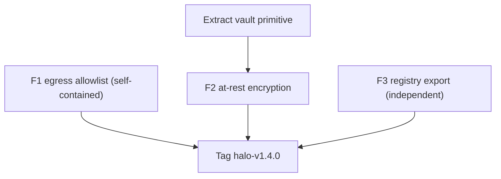

# Halo v1.4 build plan: egress allowlist, at-rest encryption, AI usage registry

Build-ready spec derived from the strategic roadmap
(`.cursor/plans/halo_data_sovereignty_and_ui_wedge_roadmap_36ec4e96.plan.md`).
Three shippable features, scoped for one minor version. Every file path and
insertion point below was verified against the current tree.

Locked scope:

- Feature 1 (P0-1): Egress allowlist / region-lock -- deny outbound to any
  upstream host not on an approved list.
- Feature 2 (P0-2): At-rest encryption for the two content-bearing local
  stores (`cache.redb`, `semantic_cache.redb`), reusing the existing vault
  primitive.
- Feature 3 (Option A): AI usage / governance registry export in the local
  dashboard (JSON + CSV), plus a `halo registry` CLI.

Non-goals for v1.4 (carried forward in the roadmap, not built here): MCP
taint "deny" mode (P1-1), sovereign-mode preset (P1-2), audit retention
(P2-1), relay hardening (P2-2), MCP-seam PII taint (P2-3), and anything that
loads or runs a model.

---

## Feature 1 -- Egress allowlist / region-lock (P0-1)

### Goal

An operator can constrain which upstream hosts Halo will ever send a request
to. Any dispatch to a host outside the allowlist is hard-denied *before the
bytes leave the process*, emits an audit event, and returns a clear error to
the agent. Applies to the LLM path, the embeddings path, and the relay upload
path -- every egress Halo itself initiates.

### Config surface (`crates/halo-shim/src/config.rs`)

Add a top-level field to `Config` (after `dashboard`, ~line 82):

```rust
/// Outbound egress policy. When `allowed_upstreams` is non-empty, Halo
/// refuses to send any request to a host not on the list -- LLM providers,
/// the embeddings API, and the relay alike. Empty list = unrestricted
/// (today's behavior), so this is opt-in and never breaks an existing
/// install. Entries are host names (no scheme/port), matched case-insensitively
/// with optional leading-dot wildcard (".example.com" matches any subdomain).
#[serde(default)]
pub egress: EgressConfig,
```

```rust
#[derive(Debug, Clone, Default, Serialize, Deserialize)]
pub struct EgressConfig {
    #[serde(default)]
    pub allowed_upstreams: Vec<String>,
}

impl EgressConfig {
    /// None = no policy configured (allow all). Some(false) = denied.
    pub fn permits_host(&self, host: &str) -> bool {
        if self.allowed_upstreams.is_empty() {
            return true;
        }
        let host = host.trim().to_ascii_lowercase();
        self.allowed_upstreams.iter().any(|rule| {
            let rule = rule.trim().to_ascii_lowercase();
            if let Some(suffix) = rule.strip_prefix('.') {
                host == suffix || host.ends_with(&format!(".{suffix}"))
            } else {
                host == rule
            }
        })
    }
}
```

Optional convenience: a `region_lock` helper that expands `us_only` / `eu_only`
into a curated `allowed_upstreams` set for OpenAI/Anthropic regional
endpoints. Recommend deferring this to a follow-up -- the raw `allowed_upstreams`
list is the primitive; region presets are sugar and risk going stale as
providers add endpoints.

### Enforcement points

Add a single shared helper (in a new `crates/halo-shim/src/egress.rs`, or as a
free function in `ingress.rs`) that extracts the host from a URL and checks it:

```rust
pub fn check_egress(cfg: &EgressConfig, url: &str) -> Result<(), String> {
    let host = reqwest::Url::parse(url)
        .ok()
        .and_then(|u| u.host_str().map(|h| h.to_string()));
    match host {
        Some(h) if cfg.permits_host(&h) => Ok(()),
        Some(h) => Err(h),
        None => Err(url.to_string()),
    }
}
```

Wire it in at each egress:

1. LLM dispatch -- `crates/halo-shim/src/ingress.rs`, immediately after
   `let base = provider_base(provider, record.base_url.as_deref());`
   (line 477) and before building `req`. On deny: emit an audit event
   (reuse the existing `AuditEvent` LLM path, `state.rs:149-158`), record a
   `PolicyDecision` (add an `EgressDenied` variant in
   `crates/halo-common/src/telemetry.rs`), and return
   `error_response(StatusCode::FORBIDDEN, "upstream host not in egress allowlist")`.
2. Embeddings -- `crates/halo-shim/src/embeddings.rs`, before the POST to
   `{base}/v1/embeddings` (~line 90-97). On deny, the semantic-cache lookup
   should fail closed (skip the cache, do NOT fall back to sending the prompt
   anyway). This is the sovereignty-critical path: it's the one place raw
   prompt text egresses to a third party.
3. Relay upload -- `crates/halo-shim/src/telemetry.rs`, before the POST to
   `<relay_url>/v1/telemetry` (~line 108-122). On deny, spool locally as if
   the upload failed (existing spool path) and log a warning.

`AppState` already carries `cfg: Arc<Config>`, so `st.cfg.egress` is available
at all three sites with no plumbing.

### Docs

- `config/halo.example.yaml`: new commented `egress:` block with the
  wildcard-matching explanation and a worked example (Anthropic-only box).
- `README.md`: a short "Egress allowlist" subsection under the trust-model
  section, framed for the automated-agent case ("even a prompt-injected agent
  can't reach an unapproved endpoint").
- `docs/DESIGN_REVIEW.md`: a v1.4 entry describing the fail-closed semantics
  and why the check lives at dispatch, not at config-load.

### Tests

- Unit (`config.rs` or `egress.rs`): `permits_host` -- empty list allows all;
  exact match; `.suffix` wildcard matches subdomain and apex but not a
  look-alike (`evil-example.com` must NOT match `.example.com`); case
  insensitivity.
- Unit: `check_egress` returns the offending host for a denied URL and `Ok`
  for an allowed one; a malformed URL is denied.
- Integration (extend the existing ingress test harness): with a one-entry
  allowlist, a request whose agent `base_url` points off-list returns 403 and
  writes an audit event; an on-list request passes through.

---

## Feature 2 -- At-rest encryption for content stores (P0-2)

### Goal

Opt-in encryption of the two stores that hold response content on disk, using
the vault primitive Halo already ships. Keyed off `$HALO_VAULT_PASSPHRASE`
(the same env var the credential fallback already uses). Off by default (no
behavior change); when enabled, cache values are unreadable at rest without
the passphrase.

### Step 1: extract the vault primitive

Today `encrypt_secret` / `decrypt_secret` / `EncBlob` are private in
`crates/halo-shim/src/keys.rs` (lines 232-277) and operate on `&str`. Extract
into `crates/halo-shim/src/vault.rs` and generalize to bytes:

```rust
pub struct EncBlob { /* salt, nonce, ciphertext -- moved from keys.rs */ }

pub fn seal(passphrase: &str, plaintext: &[u8]) -> Result<Vec<u8>>;   // -> serialized EncBlob
pub fn open(passphrase: &str, sealed: &[u8]) -> Result<Vec<u8>>;
```

`keys.rs` keeps its `&str` helpers as thin wrappers over `vault::seal/open`
so its existing tests (`encrypt_roundtrip`, `wrong_passphrase_fails`) are
unaffected.

### Step 2: encrypt cache values

`crates/halo-shim/src/cache.rs`:

- `put` (line 87): replace `serde_json::to_vec(entry)?` with, when encryption
  is on, `vault::seal(&passphrase, &serde_json::to_vec(entry)?)?`.
- `get` (line 78): when encryption is on, `vault::open` then
  `serde_json::from_slice`.
- Eviction problem: the eviction loop deserializes `created_at` from stored
  bytes (line 100). If the whole value is sealed, eviction can't read
  `created_at` without decrypting every row. Fix by storing a small cleartext
  header alongside the sealed blob -- change the table value to a 2-field
  struct `{ created_at: i64, sealed: Vec<u8> }` (serialized plaintext at the
  outer layer; only `sealed` is encrypted). `created_at` is not sensitive.
- Constructor `open` (line 54) gains an `encrypt: Option<String>` (the
  passphrase) parameter; store it on `CacheStore`.

`crates/halo-shim/src/semantic_cache.rs`: same treatment for the `answer.text`
field in `SemanticEntry` (embedding vectors can stay cleartext -- they're not
reversible to prompt text; encrypt only the stored answer). Keep the partition
key cleartext so lookup still works.

### Step 3: config + wiring

- `config.rs`: add `encrypt_at_rest: bool` to `CacheConfig` and
  `SemanticCacheConfig` (or one shared `storage.encrypt_at_rest`). Default
  `false`.
- `main.rs` `serve()`: read the passphrase once; if `encrypt_at_rest` is set
  but `$HALO_VAULT_PASSPHRASE` is unset, fail startup with a clear message
  (this is the one case where a missing passphrase should block -- the
  operator explicitly asked for encryption).
- Back-compat: a store may hold a mix of old-plaintext and new-sealed rows
  after enabling. `get` tries `vault::open` first; on failure, falls back to
  interpreting the bytes as plaintext JSON (best-effort read of pre-encryption
  entries), and the next `put` rewrites them sealed. Document that a hard
  guarantee ("no plaintext content on disk, ever") requires starting with
  encryption on or wiping the stores.

### Docs

- `config/halo.example.yaml`: document `encrypt_at_rest` and the passphrase
  requirement.
- `README.md` + `docs/DESIGN_REVIEW.md`: note which stores are covered
  (cache + semantic answer text), which are not (embedding vectors, metadata
  ledger/audit/telemetry -- explain why each is acceptable), and the
  mixed-content back-compat behavior.

### Tests

- `vault.rs`: `seal`/`open` byte round-trip; wrong passphrase fails; empty
  input.
- `cache.rs`: put-then-get round-trip with encryption on; a store opened with
  encryption on cannot read a value with the wrong passphrase; eviction still
  works (created_at header readable without the passphrase); a pre-encryption
  plaintext row is still readable after enabling encryption.
- `semantic_cache.rs`: answer text round-trips sealed; lookup/partitioning
  unaffected by encryption.

---

## Feature 3 -- AI usage / governance registry export (Option A)

### Goal

Turn the metadata Halo already tracks into an exportable "AI system registry"
/ evidence pack: which agents exist, which models/providers they've touched,
request volume, spend, cache savings, and which MCP servers are fronted. JSON
and CSV from the local dashboard and a `halo registry` CLI. No new data
collection -- pure aggregation over existing stores. Privacy-safe by
construction (metadata only; no prompt/response content, consistent with
`docs/TELEMETRY_SCHEMA.md`).

### Data assembly

New module `crates/halo-shim/src/registry.rs` with a `build_registry(...)`
that composes existing sources -- no new instrumentation:

- Agents + providers + status: `st.keys.records()` (virtual-key records,
  `keys.rs:60`).
- Per-agent/model spend, request counts, cache + semantic hit counts,
  savings: the existing `report::build` rollup (`report.rs`) already produces
  `by_agent` / `by_model` -- reuse it directly.
- MCP servers fronted: `cfg.mcp_servers` (`config.rs:67`) -- name + command,
  never `env` (which can hold secrets).
- License/entitlement context: `st.entitlements` (tier, org, expiry) so the
  registry shows the governance posture of the install itself.
- Generated-at timestamp + Halo version + `device_id`.

```rust
pub struct RegistryReport {
    pub generated_at: String,
    pub halo_version: String,
    pub device_id: String,
    pub tier: String,
    pub agents: Vec<RegistryAgent>,     // name, provider, status, base_url_host, first_seen?, requests, spend_usd, savings_usd
    pub mcp_servers: Vec<RegistryMcp>,  // name, command (no env)
}
```

### Dashboard surface (`crates/halo-shim/src/dashboard.rs`)

The dashboard is axum + one embedded HTML/JS string with thin JSON handlers,
so this is "new routes + new panel," no framework change:

- `GET /api/registry` -> `Json(RegistryReport)` (unauthenticated read, same as
  the other read endpoints on loopback).
- `GET /api/registry.csv` -> `text/csv` download with a
  `Content-Disposition: attachment; filename="halo-ai-registry-<date>.csv"`
  header. One row per agent, plus a section (or second file) for MCP servers.
- New "AI registry" panel in the embedded HTML (`const HTML`, ~lines 319-482):
  a table rendered from `/api/registry` and two buttons -- "Download CSV" and
  "Download JSON" (the JSON button just hits `/api/registry` and triggers a
  client-side blob download). Read-only; no token needed.

### CLI (`crates/halo-shim/src/main.rs`)

Add a `Registry` subcommand:

```
halo registry export [--format json|csv] [--out <path>]
```

Defaults to JSON on stdout. Cheap: it calls the same `registry::build_registry`
and serializes. Gives operators (and CI/compliance pipelines) a headless path
that doesn't require the dashboard to be running.

### Relay / fleet (paid) -- phase 2, optional

A fleet-wide registry across all devices reporting to a relay is the natural
paid upsell (gated by the existing `subject_attribution` / `multi_seat`
entitlements). Scope: a `GET /api/registry` on `halo-relay` that aggregates
its SQLite summary the same way the local one aggregates the ledger. Recommend
shipping the local (free) registry first and adding the relay rollup only if
Option A gets traction -- keep v1.4 to the local surface.

### Docs

- `README.md`: an "AI usage registry" subsection -- what it exports, that it's
  metadata-only, and the `halo registry export` command.
- `docs/halo-onepager.html`: add the registry to the free-tier feature list
  and, if phase 2 ships, the fleet registry to the paid column. This is the
  feature to lead with for the public-sector / compliance buyer (ties to the
  City of Austin Resolution-55 registry mandate).
- `docs/DESIGN_REVIEW.md`: v1.4 entry noting the registry is a pure projection
  of existing metadata and deliberately excludes MCP `env` and any content.

### Tests

- `registry.rs`: `build_registry` over a seeded ledger + key store yields the
  expected agents/models/spend; MCP `env` is never present in the output
  (explicit assertion -- this is the secret-leak guard).
- CSV serialization: stable column order; values with commas/quotes are
  escaped.
- Dashboard: `/api/registry` returns 200 with the expected shape;
  `/api/registry.csv` sets the attachment header and content type.

---

## Cross-cutting

- Version: bump workspace `version` in `Cargo.toml` (0.2.3 -> 0.2.4) and tag
  `halo-v1.4.0` on release (matches the existing tag/version convention).
- CI: no new jobs needed; the new modules are covered by the existing
  `cargo test` + `cargo clippy -D warnings` gates. Windows job already exists.
- `docs/DESIGN_REVIEW.md`: single new "v1.4" section covering all three
  features and their threat-model reasoning.

## Suggested sequencing



F1 and F3 are independent and can land in either order. F2 depends only on the
vault extraction. All three are additive and default-off / opt-in, so they can
ship together in one minor version without changing behavior for existing
installs.

## Effort (rough, engineering-days)

- F1 egress allowlist: ~1.5 (config + one helper + 3 wiring sites + tests +
  docs).
- F2 at-rest encryption: ~2.5 (vault extraction + two stores + eviction-header
  refactor + back-compat + tests).
- F3 registry export: ~2 (aggregation module + 2 routes + panel + CLI +
  tests); +~1.5 if the phase-2 relay fleet rollup is included.
